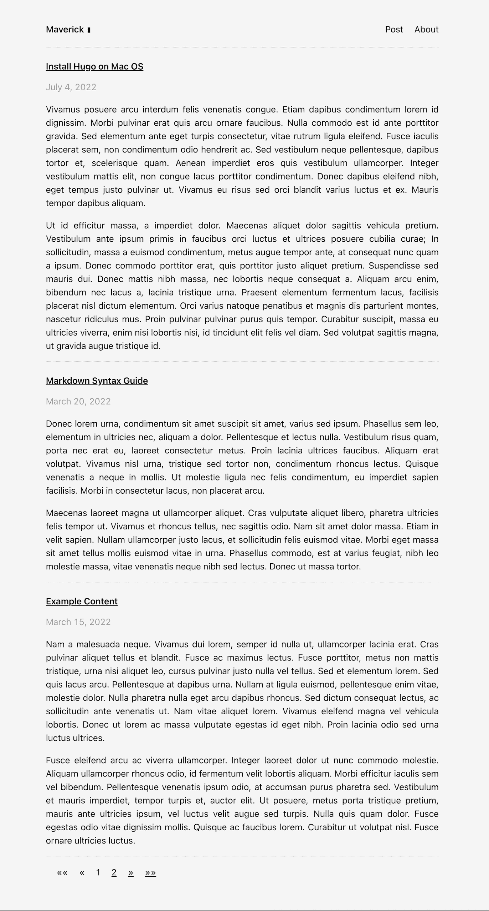
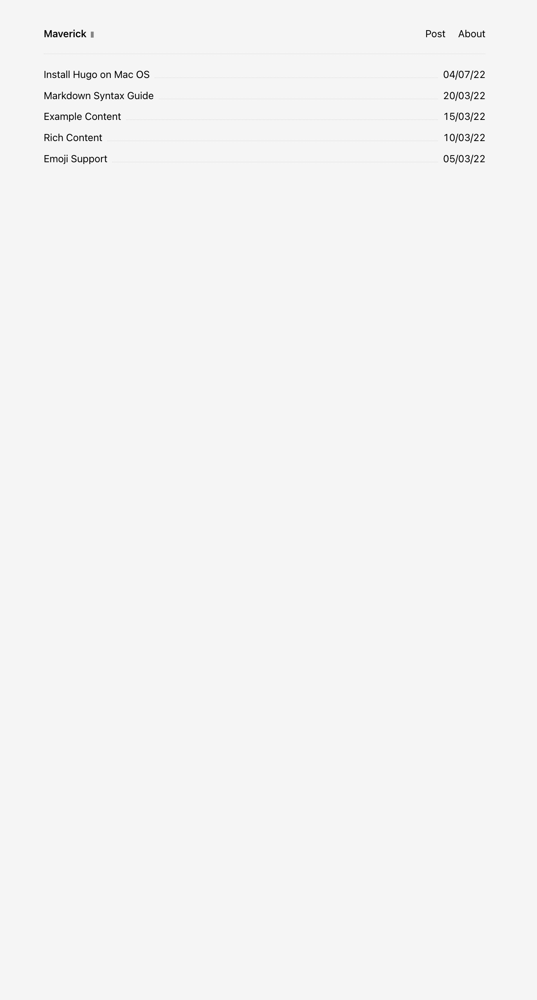

Demo: https://canhtran.github.io/maverick/


**Maverick** is a minimal Hugo blog theme with introduction page and based on [Listed](https://github.com/ronv/listed) by [Ronalds Vilciņš](https://github.com/ronv/).
This Hugo theme features several content sections, front page, dynamic pages creation and a Github comment.


Home Page             | List Posts
:-------------------------:|:-------------------------:
  |  


## Installation

### Method 1
Inside the folder of your Hugo site run:

    $ git clone https://github.com/canhtran/maverick.git themes/maverick --depth=1

For more information read the official [setup guide](//gohugo.io/overview/installing/) of Hugo.

> Updating theme :
>```
> $ cd themes/maverick
> $ git pull


### Method 2
Using as [submodule](https://www.atlassian.com/git/tutorials/git-submodule)

```
$ git submodule add --depth=1 https://github.com/canhtran/maverick.git themes/maverick
```

> Updating theme :
>```
> $ git submodule update --remote --merge

## Getting started

After installing the  successfully it requires a just a few more steps to get your site running.


### The config file

Take a look inside the [`exampleSite`](//github.com/canhtran/maverick/tree/main/exampleSite) folder of this theme. You'll find a file called [`config.toml`](//github.com/canhtran/maverick/blob/main/exampleSite/config.toml). To use it, copy the [`config.toml`](//github.com/canhtran/maverick/blob/main/exampleSite/config.toml) in the root folder of your Hugo site. Feel free to change the strings in this theme.

### Github comment

The theme is integrated with [https://utteranc.es](https://utteranc.es) for Github comment. Utterance creates Github issue for each article. It uses Github issues for comments

1. Grant the access for Utterancs [https://github.com/apps/utterances](https://github.com/apps/utterances)
2. Modify the config file
```
  [params.comments]
    enabled = true
    githubRepo = 'canhtran/maverick'
    theme = 'github-light'
```
Note: if you don't want to display the comment, change `enabled = false`

### Front page

To change the contain of the front page, you need to modify the [`_index.md`](//github.com/canhtran/maverick/blob/main/exampleSite/content/_index.md)

### Number of post in the front page

Modify the config file
```
[params]
  logo = '/assets/favicon.ico'
  description = "A minimal hugo theme focus on content"
  author = 'Calvin Tran'
  items: 10
```

### Nearly finished

In order to see your site in action, run Hugo's built-in local server. 

    $ hugo server

Now enter [`localhost:1313`](http://localhost:1313/) in the address bar of your browser.


## Contributing

Did you found a bug or got an idea for a new feature? Feel free to use the [issue tracker](https://github.com/canhtran/maverick/issues) to let me know. Or make directly a [pull request](https://github.com/canhtran/maverick/pulls).


## License

This theme is released under the Apache License 2.0 For more information read the [License](https://github.com/canhtran/maverick/blob/main/LICENSE).